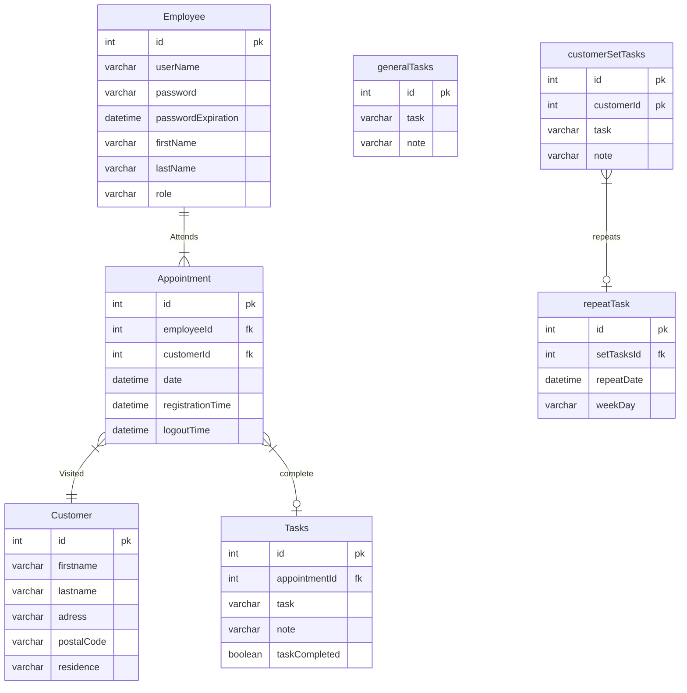

```mermaid
erDiagram
  Employee ||--|{ Appointment : Attends
  Employee{
  int id pk
  varchar userName
  varchar password
  datetime passwordExpiration
  varchar firstName
  varchar lastName
  varchar role
  }

  Appointment }|--|| Customer : Visited
  Appointment }|--|o Tasks : complete
  Appointment{
  int id pk
  int employeeId fk
  int customerId fk
  datetime date
  datetime registrationTime
  datetime logoutTime
  }

  Customer{
  int id pk
  varchar firstname
  varchar lastname
  varchar adress
  varchar postalCode
  varchar residence
  }

  Tasks{
  int id pk
  int appointmentId fk
  varchar task
  varchar note
  boolean taskCompleted
  }

  generalTasks{
  int id pk
  varchar task
  varchar note
  }

  customerSetTasks }|--|o repeatTask : repeats
  customerSetTasks{
  int id pk
  int customerId pk
  varchar task
  varchar note
  }

  repeatTask{
  int id pk
  int setTasksId fk
  datetime repeatDate
  varchar weekDay
  }


```
