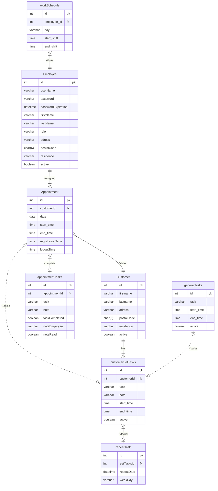

```mermaid
erDiagram
  Employee ||--|{ Appointment  : Assigned
  Employee{
  int id pk
  varchar userName
  varchar password
  datetime passwordExpiration
  varchar firstName
  varchar lastName
  varchar role
  varchar adress
  char(6) postalCode
  varchar residence
  boolean active
  }


  workSchedule }|--|| Employee : Works
  workSchedule{
  int id pk
  int employee_id fk
  varchar day
  time start_shift
  time end_shift
  }


  Appointment }|--|| Customer : Visited
  Appointment }|--|o appointmentTasks : complete
  Appointment o|..|o customerSetTasks : Copies
  Appointment{
  int id pk
  int customerId fk
  date date
  time start_time
  time end_time
  time registrationTime
  time logoutTime
  }

  appointmentTasks{
  int id pk
  int appointmentId fk
  varchar task
  varchar note
  boolean taskCompleted
  varchar noteEmployee
  boolean noteRead
  }

  Customer ||--|{ customerSetTasks : has
  Customer{
  int id pk
  varchar firstname
  varchar lastname
  varchar adress
  char(6) postalCode
  varchar residence
  boolean active
  }

  generalTasks o|..|o customerSetTasks : Copies
  generalTasks{
  int id pk
  varchar task
  time start_time
  time end_time
  boolean active
  }

  customerSetTasks }|--|o repeatTask : repeats
  customerSetTasks{
  int id pk
  int customerId fk
  varchar task
  varchar note
  time start_time
  time end_time
  boolean active
  }

  repeatTask{
  int id pk
  int setTasksId fk
  datetime repeatDate
  varchar weekDay
  }


```
