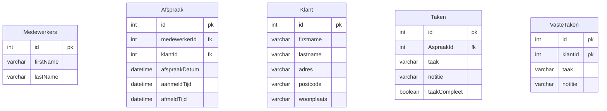

```mermaid
erDiagram
  Medewerkers{
  int id pk
  varchar firstName
  varchar lastName
  }

  Afspraak{
  int id pk
  int medewerkerId fk
  int klantId fk
  datetime afspraakDatum
  datetime aanmeldTijd
  datetime afmeldTijd
  }

  Klant{
  int id pk
  varchar firstname
  varchar lastname
  varchar adres
  varchar postcode
  varchar woonplaats
  }

  Taken{
  int id pk
  int AspraakId fk
  varchar taak
  varchar notitie
  boolean taakCompleet
  }

  VasteTaken{
  int id pk
  int klantId pk
  varchar taak
  varchar notitie
  }


```
