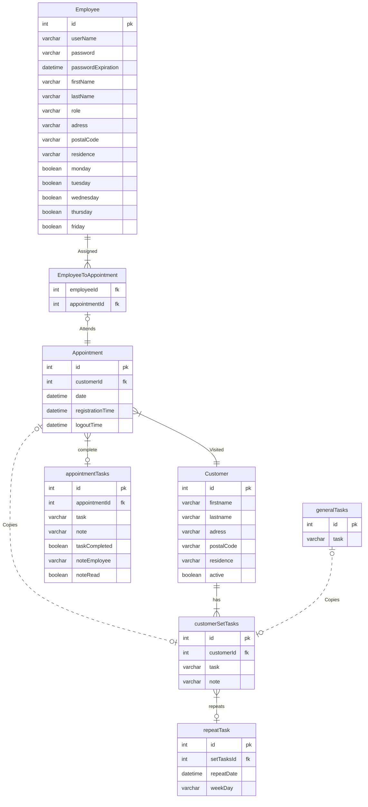

```mermaid
erDiagram
  Employee ||--|{ EmployeeToAppointment : Assigned
  Employee{
  int id pk
  varchar userName
  varchar password
  datetime passwordExpiration
  varchar firstName
  varchar lastName
  varchar role
  varchar adress
  varchar postalCode
  varchar residence
  boolean monday
  boolean tuesday
  boolean wednesday
  boolean thursday
  boolean friday
  }

  EmployeeToAppointment o|--|| Appointment : Attends
  EmployeeToAppointment{
  int employeeId fk
  int appointmentId fk
  }

  Appointment }|--|| Customer : Visited
  Appointment }|--|o appointmentTasks : complete
  Appointment o|..|o customerSetTasks : Copies
  Appointment{
  int id pk
  int customerId fk
  datetime date
  datetime registrationTime
  datetime logoutTime
  }

  appointmentTasks{
  int id pk
  int appointmentId fk
  varchar task
  varchar note
  boolean taskCompleted
  varchar noteEmployee
  boolean noteRead
  }

  Customer ||--|{ customerSetTasks : has
  Customer{
  int id pk
  varchar firstname
  varchar lastname
  varchar adress
  varchar postalCode
  varchar residence
  boolean active
  }

  generalTasks o|..|o customerSetTasks : Copies
  generalTasks{
  int id pk
  varchar task
  }

  customerSetTasks }|--|o repeatTask : repeats
  customerSetTasks{
  int id pk
  int customerId fk
  varchar task
  varchar note
  }

  repeatTask{
  int id pk
  int setTasksId fk
  datetime repeatDate
  varchar weekDay
  }


```
